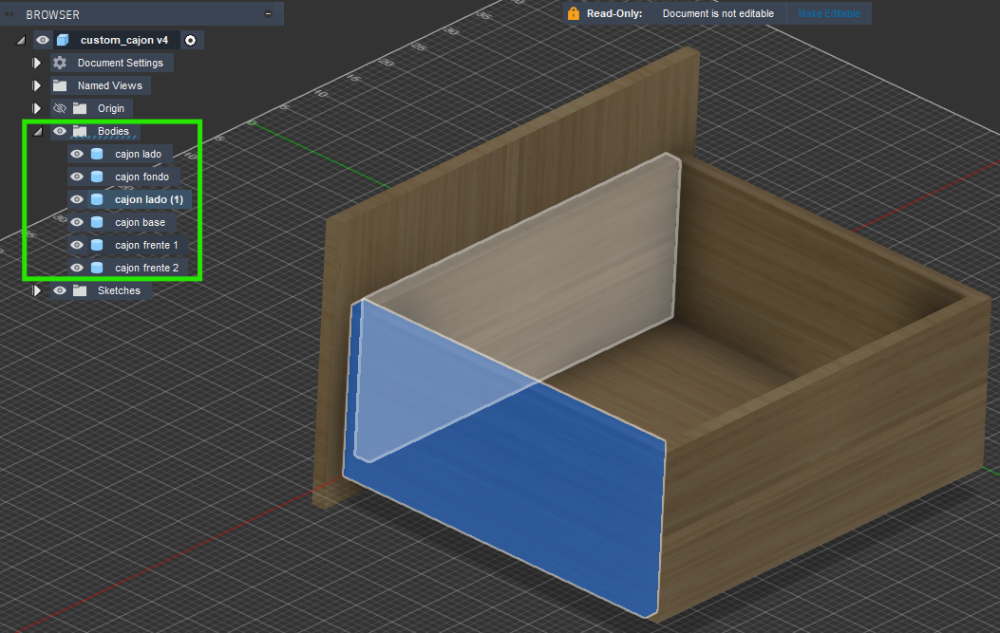
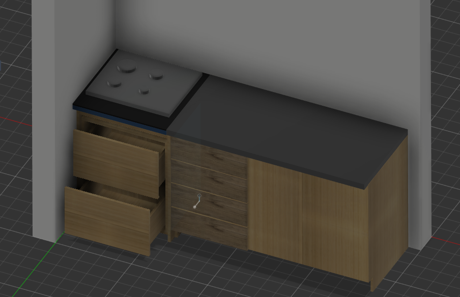
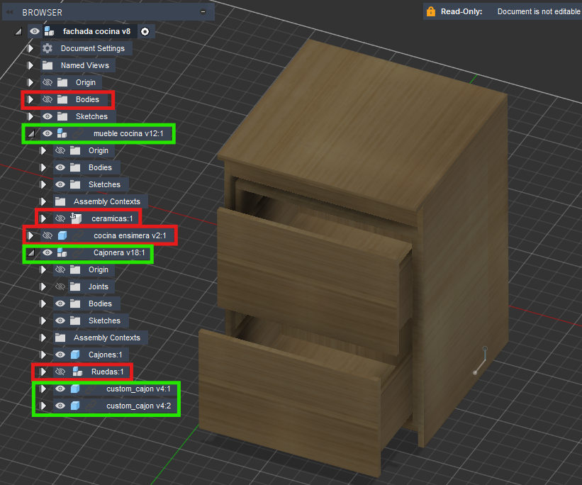
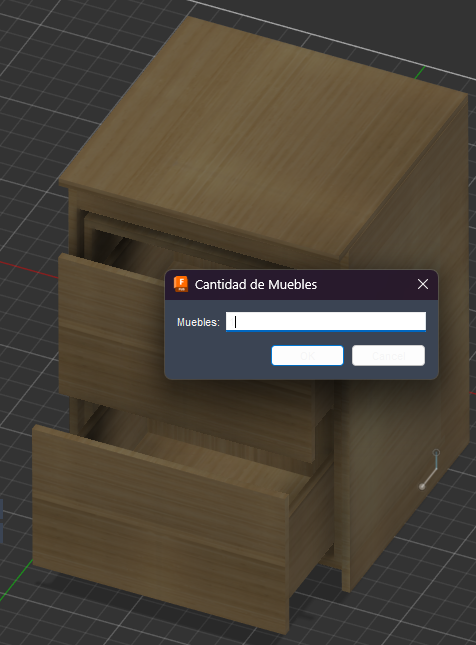
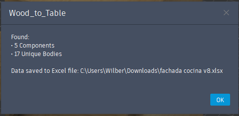
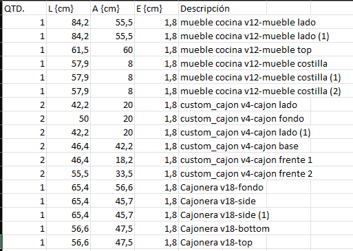
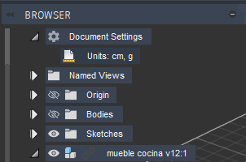
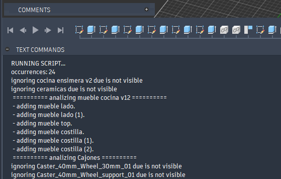
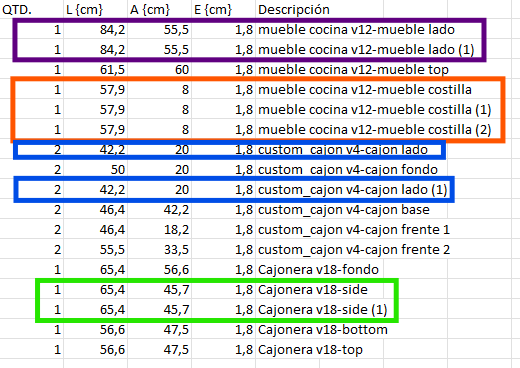
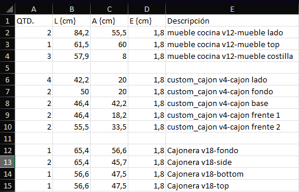

# Wood To Table

This is a Fusion 360 script that generates an Excel table with the necessary cuts for wood laminate, based on the size of each body.

> ⚠️ Your designs **must be created using separate bodies**. Each body represents one wood cut.

Example:  

## Guide

### 1. Design your furniture
As a personal recommendation, consider also modeling the surrounding environment. It doesn't need to be detailed—just enough to help you better visualize how the furniture will look in a real-world setting.

### 2. Hide the components you want to ignore
* You can hide main component bodies and subcomponents.
* Keep visible only the bodies that should be included in the cut list.

### 3. Specify the furniture quantity
* The default value is 1.

### 4. Check the auto-generated Excel file
The script will generate an Excel file with all the visible bodies.

* The units will match the ones defined in the **Document Settings**.  
  

* You can also check the log output for more information.  
  

### 5. Organize the file
Since each wood item is a body, there might be duplicate entries for identical parts (e.g., table legs). You'll need to organize and consolidate these in the Excel file.

* Example:

    Auto-generated result:  
    

    Organized version:  
    
