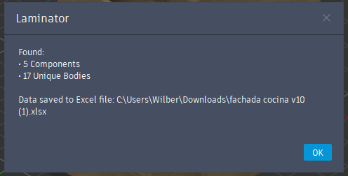

## Guide

### 1. Design you furniture

### 2. Hide the components to ignore it
* You can hide main component bodies and subcomponents.
* Keep visible only items to be made of wood.

### 3. Specifies the quantity of furniture
* Default value is 1

### 4. Check the auto generated excel file 

* The unit will be the same as the specified on Document Settings
    

* You can also check the logs for more information

    

### 5. Clean the file

* Since each wood item is a body, we can have duplicated bodies that are really the same. For example table legs, so we need to do a litte organization to the excel table.

* Example:

    Auto-generated result:
    

    Organized:
    
